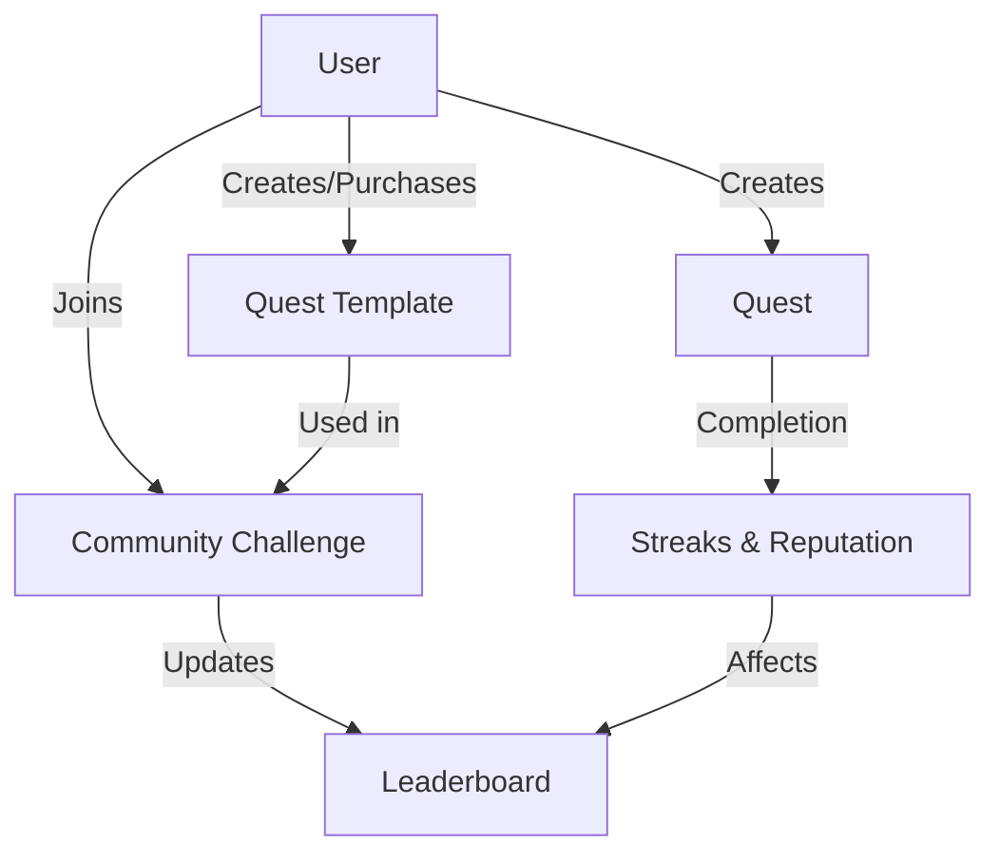

# Continuous Reward Sentinel

A decentralized achievement and reward tracking system for monitoring continuous progress and incentivizing sustained performance on the Stacks blockchain.

## Overview

Continuous Reward Sentinel is an innovative blockchain-based platform designed to create transparent, verifiable, and dynamic reward mechanisms for ongoing achievements. By leveraging smart contract technology, the platform enables structured tracking of progress, automatic reward distribution, and community-driven incentive models.

### Key Features

- Dynamic reward allocation based on consistent performance
- Flexible tracking of achievements across multiple domains
- Transparent and immutable progress recording
- Customizable reward strategies
- Reputation-based incentive mechanisms
- Community-driven challenge and tracking systems

## Architecture

The system is built on a single smart contract that manages all core functionality through interconnected data structures and functions.



### Core Components

1. **Quests**: Personal habit tracking units with customizable parameters
2. **User Profiles**: Track reputation, streaks, and overall progress
3. **Quest Templates**: Shareable and purchasable quest blueprints
4. **Community Challenges**: Group competitions based on shared templates
5. **Leaderboards**: Track participant progress in challenges

## Contract Documentation

### Quest Management

#### Creating Quests

```clarity
(create-quest 
  name: string-ascii
  description: string-utf8
  frequency: uint
  custom-interval: optional uint
  difficulty: uint
  rewards: uint
  template-id: optional uint) -> (response uint uint)
```

Creates a new quest with specified parameters. Returns the new quest ID.

#### Completing Quests

```clarity
(complete-quest quest-id: uint) -> (response bool uint)
```

Logs completion of a quest and updates streaks, reputation, and challenge leaderboards if applicable.

### Community Features

#### Creating Templates

```clarity
(create-quest-template
  name: string-ascii
  description: string-utf8
  frequency: uint
  custom-interval: optional uint
  difficulty: uint
  recommended-rewards: uint
  for-sale: bool
  price: uint) -> (response uint uint)
```

Creates a shareable quest template that can be sold to other users.

#### Community Challenges

```clarity
(create-community-challenge
  name: string-ascii
  description: string-utf8
  quest-template-id: uint
  start-date: uint
  end-date: uint) -> (response uint uint)
```

Creates a community challenge based on a quest template.

## Getting Started

### Prerequisites

- Clarinet
- Stacks Wallet
- Basic understanding of Clarity

### Installation

1. Clone the repository
2. Install dependencies with Clarinet
3. Deploy contract to local Clarinet chain or testnet

### Basic Usage

1. Create a quest:
```clarity
(contract-call? .quest-hive create-quest "Morning Meditation" "Daily 10-minute meditation" u1 none u1 u10 none)
```

2. Complete a quest:
```clarity
(contract-call? .quest-hive complete-quest u1)
```

3. Join a community challenge:
```clarity
(contract-call? .quest-hive join-challenge u1)
```

## Function Reference

### Read-Only Functions

- `get-user-quests`: Returns list of user's quests
- `get-quest`: Returns quest details
- `get-user-profile`: Returns user profile information
- `get-quest-streak-info`: Returns streak information for a quest
- `get-challenge-leaderboard`: Returns challenge leaderboard data

### Public Functions

- `create-quest`: Create new quest
- `complete-quest`: Log quest completion
- `create-quest-template`: Create shareable template
- `join-challenge`: Join community challenge
- `purchase-template`: Purchase quest template
- `toggle-quest-active`: Toggle quest active status

## Development

### Testing

Run tests using Clarinet:
```bash
clarinet test
```

### Local Development

1. Start local Clarinet console:
```bash
clarinet console
```

2. Deploy contract:
```bash
(contract-call? .quest-hive ...)
```

## Security Considerations

### Limitations

- Quest completion verification relies on self-reporting
- Community challenges have participant limits
- Template purchases require sufficient reputation

### Best Practices

- Always verify transaction success
- Monitor streak calculations for accuracy
- Consider gas costs when interacting with multiple functions
- Verify quest ownership before modifications
- Keep private keys secure when interacting with mainnet